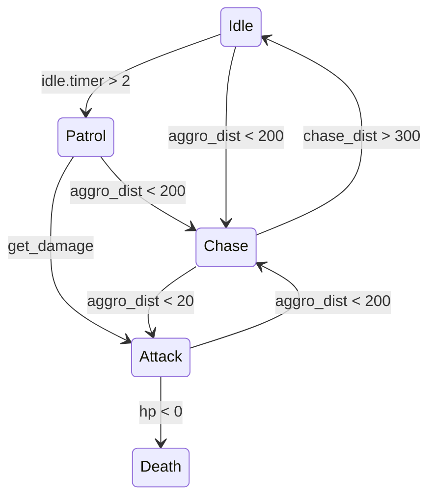
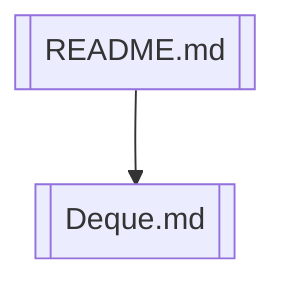

A Finite State Machine (FSM) is a computational model used to design logic where a system can exist in only one of a finite number of distinct states at any given time.

In the context of current development, this is the basic AI for NPCs (enemies)

The basic StateMachine interface provides a constructor method and 3 main functions:
```lua
local State = {}
State.__index = State

--- Class constructor
--- @param name string state name (for debug)
--- @return table new state object
function State:new(name)
    local self = setmetatable({}, State)
    self.name = name or "unnamed"
    return self
end

--- calling once when enemy enters this state
function State:enter(enemy) end

--- calling every frame
function State:update(enemy, dt) end

--- calling once when enemy enters this state
function State:exit(enemy) end

local FSM = {}
FSM.__index = FSM

--- Class constructor
--- @param owner table state owner
--- @param initial_state table initial state object
--- @return table new FSM object
function FSM:new(owner, initial_state)
    local self = setmetatable({}, FSM)
    self.owner = owner
    self.state = nil

    if initial_state then
        self:set_state(initial_state)
    end

    return self
end

--- switch state
function FSM:set_state(new_state)
    if self.state then
        self.state:exit(self.owner)
    end

    self.state = new_state

    if self.state then
        self.state:enter(self.owner)
    end
end

function FSM:update(dt)
    if self.state then
        self.state:update(self.owner, dt)
    end
end

--- for debug
function FSM:get_state_name()
    if self.state then
        return self.state.name
    end
    return "none"
end

State.FSM = FSM

return State
```

Further, based on it, we can create our own states:
```lua
local State = require("scripts.custom_libs.abstract_types.state")

local IdleState = State:new("Idle")
function IdleState:enter(enemy)
    -- do something when enemy enters idle state
end
function IdleState:update(enemy, dt)
    -- do something every frame when enemy is in idle state

    if enemy:can_see_player() then
        enemy.fsm:set_state(enemy.states.chase)
        --- after calling set_state 
    end
end
function IdleState:exit(enemy)
    -- do something when enemy exits idle state
end
```

And then we can create an FSM for our enemy and use it in the update loop:
```lua
local Enemy = {}
function Enemy:new()
    local self = setmetatable({}, { __index = Enemy })
    self.fsm = State.FSM:new(self, self.states.idle)
    return self
end
function Enemy:update(dt)
    self.fsm:update(dt)
end
```

So, next we can create more states (like ChaseState, PatrolState, etc.) and switch between them based on the game logic. It is convenient to represent the following in the form of graphs:


